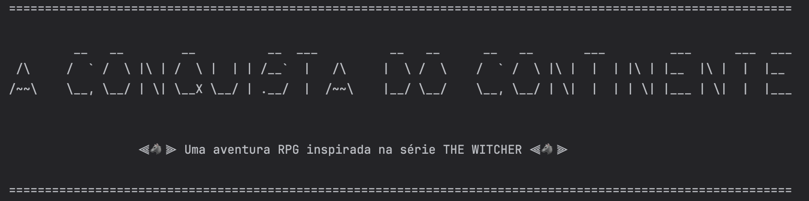
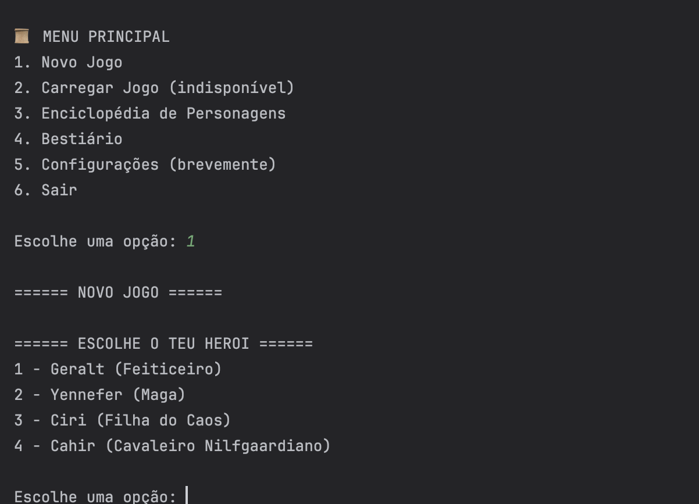
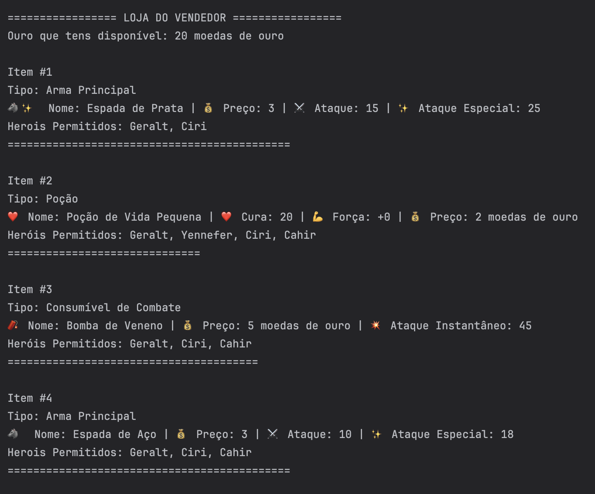
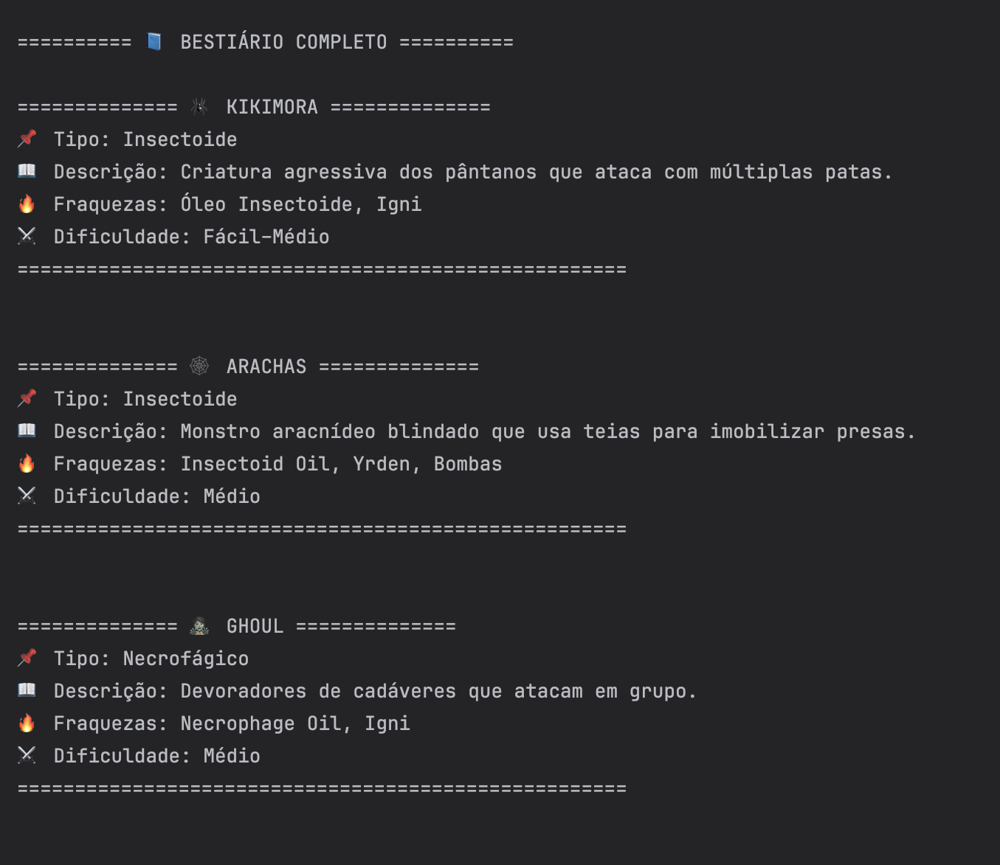

# ⚔️ Conquista do Continente


**Conquista do Continente** is a **Java console RPG** inspired by the universe of **The Witcher**.

In this adventure, the player chooses a hero — **Geralt, Yennefer, Ciri, or Cahir** — selects the game difficulty, distributes attribute points, and embarks on a journey across a dangerous continent filled with monsters and strategic battles.

The game features **turn-based combat**, character progression, an **inventory and shop system**, and narrative elements.  
The ultimate goal is to survive the challenges of the continent and defeat **Emperor Emhyr**.

To enrich the experience, the game also includes a **Character Encyclopedia** and a **Bestiary**, allowing players to explore the lore of the game world and learn more about the enemies they encounter.

---

# 🖼️ Game Preview

<p align="center">
  
</p>
<p align="center">
  
  
  
</p>

---

# ✨ Features

- 🧙 Character creation with hero selection, difficulty level, and attribute distribution  
- ⚔️ **Turn-based combat system** with normal attacks, special abilities, and consumables  
- 🦸 Heroes with unique abilities and gameplay styles  
- 🛒 Shop system with weapons and consumable items  
- 🎒 Inventory and resource management  
- 📚 **Character Encyclopedia** from The Witcher universe  
- 🐉 **Bestiary** with information about monsters, weaknesses, and difficulty levels  

---

# 🛠 Technologies Used

| Technology | Purpose |
|------------|--------|
| **Java** | Core programming language |
| **Object-Oriented Programming** | Game architecture |
| **Console Interface** | User interaction |

Concepts used in the project include:

- Classes and objects  
- Inheritance  
- Polymorphism  
- Abstraction  
- Encapsulation  

---

# 🚀 Running the Project

### Compile the project

```bash
javac -d out $(find src -name '*.java')
```

### Run the application

```bash
java -cp out Jogo.Menu
```

---

# 🎯 Project Goals

This project was developed as part of learning **Object-Oriented Programming (OOP)**.

The goal was to apply key OOP principles to create an **interactive console-based RPG**, focusing on:

- structured class design  
- modular game systems  
- reusable code  
- interactive gameplay logic  

The project demonstrates how **OOP concepts can be used to build a small game engine and narrative experience in Java**.

---

# 👩‍💻 Author

**Catarina Rato**

Academic project developed to explore **Java programming and Object-Oriented Design**.
